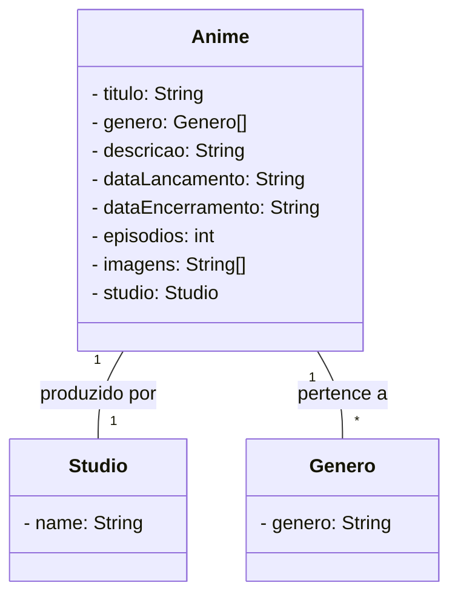

## Desafio

### Tecnológias

- Spring Data JPA
- Spring Web
- H2 databese
- Postgresql

### Descrição

Api Rest para catalogo de animes, com informaões do titulo, descrição, genero, data de lançamento e encerramento, número de episodios, studio e imagens.

### Diagrama de Classes

