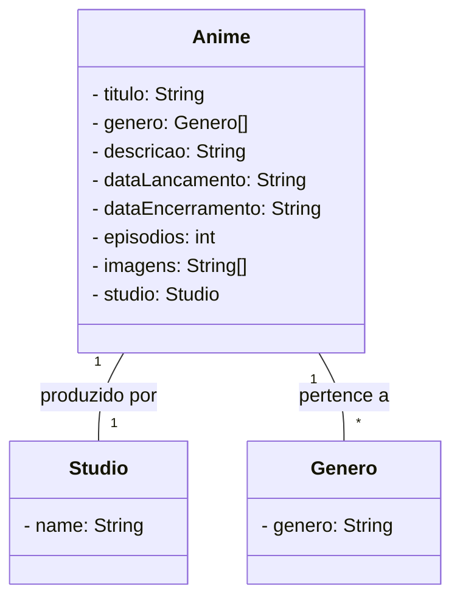

## Desafio

### Tecnológias

- Spring Data JPA
- Spring Web
- H2 databese
- Postgresql

### Descrição

Api Rest para catalogo de animes, com informaões do titulo, descrição, genero, data de lançamento e encerramento, número de episodios, studio e imagens.

### Estrutura do Json

```
{
  "titulo":"One punch man",
  "generos":[{
    "genero":"Ação"
  },{
      "genero":"Comedia"
  }],
  "descricao":"Saitama treinou muito",
  "dataLancamento":"2018-06-23 ",
  "dataEncerramento":"2018-12-06 ",
  "episodios":12,
  "imagens":["imagen1","imagen2"],
  "studio":{
    "name":"Madhouse"
  }
}
```

### Diagrama de Classes

